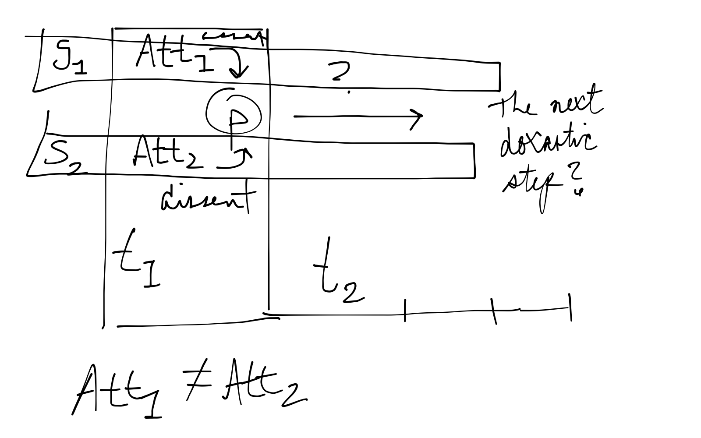

Survey in Epistemology <small>with Professor Alvin Goldman</small>
==================================================================

September 8th, 2013 <small>Chapter 1, 'The Structure of Justification'</small>
------------------------------------------------------------------------------

### The Concepts and Questions of Epistemology

-   Epistemology is the study of knowledge and related phenomena.
-   Why is this important?
    -   It can lead to better decisions.

-   How do we get truths? **Justification**.
    -   A justified or warranted belief is more likely to be true.
    -   A randomly or haphazardly chosen belief is less likely to be
        true.
    -   So how do we get the first?

-   What is a belief (alternatively opinion?)
    -   It is a *psychological attitude towards a proposition*.
        -   Where a proposition is (roughly) content which purports to
            be fact.

    -   To believe is to *mentally assent* to a propositions.
    -   Possible doxastic attitudes:
        1.  **Belief**, to mentally assent.
        2.  **Disbelief**, to mentally dissent.
        3.  **Suspension**, to neither assent nor dissent.

> It is widely thought that forming a belief that is reasonable,
> warranted, or justified is the best means available of forming a true
> belief

-   Epistemic evaluations are different from moral evaluations.
    -   They express evaluations on an *intellectual dimension*.

-   Truth and justification are not equivalent.
    -   Truth is purely metaphysical.
    -   It is true or false *of the world*.
    -   You can have a justified false belief.

-   Justification is one form of epsitemic evaluation, but perhaps there
    are others.
    -   For instance, rationality may be another, unique or not.

-   Some points of widespread agreement:
    1.  Knowledge implies truth;
    2.  A person must believe p, or have reasonably high credence in p,
        in order to know it;
    3.  Knowledge requires justification.

### The Epistemic Regress Problem

-   Many sources of justification are inference.
-   Justification needn't be spoken.
-   The structure of justification is a tree, where properly justified
    beliefs (nodes) inherit justification from roots
    -   With roots in truth?

-   Where does the original justification come from?
    -   This is the **regress problem**.

-   Possible solutions:
    -   **Infinitism**: An unending continuation of reasons, without
        repetition or end.\
    -   **Foundationalism**: An ending tree of reasons.
    -   **Coherentism**: A tree that loops back on itself.
    -   **Skepticism**. None of the first three solutions to the regress
        problem is satisfactory.

-   There are two types of ways of looking at justification with regards
    to time.
    -   **Synchronic**: A synchronic reason for a belief happens at the
        same time as the target belief.
    -   **Diachronic**: A diachronic reason is unavailable at the
        formation of the target belief?

### Infinitism

> Infinitism is rarely given serious consideration.

-   If justification goes back infinitely far, then we hold infinitely
    many beliefs?
    -   No human person has infinitely many beliefs.

-   Perhaps justification needn't originate anywhere.
-   What about with regards to people holding infinitely many beliefs?
    -   **Doxastic justification** is a property of existing beliefs.
    -   **Propositional justification** arises from the state or
        condition of an epistemic agent that entitles her to believe a
        proposition.

> infinitism can be interpreted as the view that there are infinitely
> many propositions (rather than beliefs) that form chains of
> inferential justification.

-   This may support foundationalism, however, because if justification
    isn't (ultimately) a doxastic attitude, then there is an end to the
    held beliefs which can serve an agent.
    -   There is no way that infinitist ghost propositions can be
        measured without making the propositions becoming beliefs.

-   "Justification is limited in RAM, unlimited in HDD storage."

### Coherentism

-   Coherentism is a minority view today, but historically important.
    -   Largely, the view *tolerates circular inference*.
    -   "Sometimes circularity is okay."

-   There are no "privileged beliefs" that are tethered to truth, but
    rather any net of self-supporting justification are valid
    epistemologically.
    -   "Justification is a circularly linked list."

-   Coherence and justifiedness are not intimately linked at all, and
    coherence and truth are similarly unlinked (thought not for the same
    reasons, justification and truth are distinct).

### Foundationalism and Basic Beliefs

> Foundationalism’s response to the regress problem says that every root
> in a tree of (successful) inferential justification terminates after
> finitely many steps.

-   Foundational beliefs have two crucial properties:
    -   The are *uninferred*;
    -   They are justified.

-   There are four questions that foundationalism must address to
    succeed:
    1.  Exactly what does it take for a belief to attain the status of
        "justified" in an unmediated or non-inferential fashion? What
        must take place or hold true of a belief to confer on it the
        property of being immediately justified?
    2.  Which types of belief or families of belief qualify as
        immediately justified? What kinds of propositional contents lend
        themselves to immediate justification?
    3.  What strength of justification do immediately justified beliefs
        need to attain according to foundationalism? Must basic beliefs
        exhibit the highest grade of justification, i.e., certainty,
        infallibility, or incorrigibility? Or can basic beliefs have
        weaker degrees of justification while still being basic?
    4.  Assuming that many immediately justified beliefs are available,
        does this enable epistemic agents to draw enough reasonable
        inferences that they can attain a large corpus of justified
        beliefs (both basic and non-basic), enough to dispel the specter
        of skepticism that is often laid at foundationalism's doorstep?

September 9th, 2013 <small>Seminar</small>
------------------------------------------

### Concepts and Questions

-   Doxastic attitudes, "Epistemic terms of appraisal"
    -   Beliefs, non-belief,
    -   Tripartite approach.
    -   What are others?
        -   Degrees of conviction
        -   "High confidence", expresses a doxastic attitude, on a range
            of attitudes.

    -   It's not like desiring, or hating.
        -   It's an attitude about truth or falsity.
        -   An "intellectual" attitude.
        -   Abstaining from being committal.

-   Are beliefs epistemic states?
    -   Lots of philosophers talk about beliefs as epistemic states.
        -   Doxastic attitudes are psychological states.
        -   Epistemic states are evaluations on intellectual dimensions.

-   "Know" is traditionally thought not to be an entirely mental state.
    -   It's partly:
        -   Having a belief.
        -   Having a justified belief.
        -   And being true.

    -   Knowledge is a "mental state plus …"
        -   Something like justification
        -   An epistemic component.

-   We never want to mix up truth and justification.
    -   Justification is limited to an epistemic or doxastic agent.
    -   Justified *for whom*?
    -   Justified *when*?

-   "You're justified in believing, but you don't."
    -   Propositional justification.

-   "You're justified in believing, and you do."

### The Regress Problem

-   An inferential regress.
-   To give a reason is to say something.
    -   You might have a reason, but not say it.

-   The skeptic thesis:
    -   We do not have as many JTBs as we think we do commonsensically.

-   If you say we're talking about doxastic justification, then yes,
    maybe we cannot have infinitely many psychological states.
    -   "Propositional justifiedness"

### Coherentism

-   Was popular in idealism (one or another) in Britain and American
    dominant.
    -   These involved people that are not read anymore.
    -   Royce, Bradley.
    -   Late 19th century.
    -   Very popular
    -   They often talk about in the kind of abstract way that
        infinitism will be defended.
    -   The methodology was much more abstract.

-   There are senses within belief.
    -   The belief *itself*, the psychological action.
    -   The belief's *content*, the proposition believed.

-   We want to distinguish between saying that "*p* is justified" and
    "*p* is justified for *S* at time *t*."
    -   The second one is okay and is precise.
    -   The first is not useful in epistemology.
    -   Propositions do not do any justification of their own,
        propositions are not justified.
        -   Beliefs *in* propositions *by* agents are justified *for
            them*.
        -   You do not get anything from propositional coherence.

-   What's the relationship between rationality and justification.
    -   There's no common practice.

-   Can coherence account for non-coherent justified beliefs?

### Foundationalism

-   Descartes thought that "basic beliefs" (new terminology) are about
    the agent's mental states.
-   Well what are basic/immediate beliefs like?
    -   Early on, beliefs about mental states.
    -   Later, beliefs from perception.

September 16th, 2013 <small>Chapter 2, part I, 'Evidentialism vs. Reliabilism'</small>
--------------------------------------------------------------------------------------

-   **justifier** refers to anything that helps make a belief state
    justified or unjustified.
    -   Anything that contributes to the **justificational status** of a
        target belief.

> How can one legitimately infer outward (to the external world),
> forward (to the future), and backward (to the past) from the
> indicated, very limited, data-set?

-   **Evidentialism**: all (positive or negative) justifiers of a belief
    held by epistemic agent *S* at time *t* are evidential states *S* is
    in at *t*.
    -   there must be a relation of **fittingness** that holds between
        the attitude of belief (directed at *P*) and *S*’s total
        evidential states at *t*.
    -   *X* is evidence for *Y* just in case possessing *X* enhances a
        person’s justification for believing *Y*.

> what justifies me in thinking that the fusiform gyrus of my right
> occipital cortex is being activated is that the fusiform gyrus of my
> right occipital cortex is being activated

-   **Reliablism**: Belief *B* is justified if and only *B* is produced
    by a reliable belief-forming process, i.e., a process that has a
    tendency to generate (belief) outputs with a high percentage of
    truths.

### Questions

1.  pg. 4, "According to evidentialism, all (positive or negative)
    justifiers of a belief held by epistemic agent S at time t are
    evidential states S is in at t." This took a few reads and a
    cross-check with the Wikipedia to fully understand. Specifically, I
    didn't know what it meant for S to be "in an evidential state." When
    I worked out what that meant, the definition was easily understood.
    -   This was supremely cleared up on pg. 7, with the precise
        formulation of evidentialism, what it implies.

2.  pg. 10, "Nonetheless, it is perfectly plausible that her belief in
    this proposition is justified." This actually happens all the time!
    It may add something to the credibility and plausibility of the case
    to name the psychology term for it: Source Amnesia.
    -   pg. 11, "it plays no causal role in her current belief in D." I
        cannot find anything defined with that variable, thought I think
        I can reasonably assume it's the claim about the earth.

3.  pg. 18, "Thus, wishful thinking is “bad” because the beliefs it
    outputs are only occasionally true." Wouldn't wishful thinking still
    be bad even if the beliefs it outputs were more often than not true?
    It's not clear to me from the example wishful think is bad because
    of unreliability, but it is certainly unreliable.
    -   pg. 18, "The overextended version of disjunctive syllogism is
        “bad” because it would frequently lead to erroneous conclusions
        even when the inputs to it are true." This is closer to my
        intuition, but all it would take for me to think that it was bad
        was one case where even one invalid logical schema was used. A
        good schema is always gets good conclusions for when the inputs
        are true.
    -   After I read the definition for process reliablism a bit further
        down along with the suitably vague portion, it seems very
        plausible for longer belief forming processes like perception
        (which is vague, which has variable successes and failures), but
        not so applicable to using bad logic rules. I think the
        difference is that a bad logic schema has concrete, knowable
        cases of when it always gets it wrong.
    -   After (CR) and (UR), this was cleared up I think.

4.  pg. 24, "By contrast, teliabilism seems to secure it easily." You
    may or may not have seen this typo, but I'll add it just in case.

September 16th, 2013 <small>Seminar</small>
-------------------------------------------

### Question time

-   Well-foundedness was introduced later by Feldman, it isn't there on
    the literature of foundationalism or coherentism. "Current-time
    slice theories." There can be no longer causal process.
    -   There was a tradition in logical positivists, that psychological
        factors do not belong in justification. Many important
        philosophers were anti-psychologistic.
        -   Influetial idea that the context of discovery, "thinking up"
            the idea, as opposed to the context of justification. The
            logic of justification or confirmation, that's one thing,
            and that's to be studied by formal logic and confirmation
            theory. Philsophy of science wing of epistemology.

    -   How you came to believe it is a psychological issue.
    -   It's be chosen because:
        1.  It's influential.
        2.  It's a nice contrast to reliablism.
            -   Fits nicely internalism/externalism.

-   The canonical way of talking about doxastic: "*p* is justified in
    *D* for *S* at *t*."
    -   *D* could be believing, disbelieving, or suspending
        justification.
    -   Does this mean *S* **does** believe it?
    -   Some people definitely think of propositional justification as
        the main type philosophers are interested in.

-   Propositional justification makes it difficult to talk about causal
    theories.
-   Propositional justification is defined in terms of doxastic, "If you
    were to hold this doxastic attitude."
-   Most epistemologists think knowledge requires justification.
    -   What type?

-   On the example of Chad and his poor reasoning
    -   I do not think that reliablism gets it right or that it's a
        problem for evidentialism.

-   Some background on evidentialist position:
    -   Evidence is always mental states
        -   There are experiential mental states.
        -   There are doxastic mental states, belief, disbelief, and
            suspension.

    -   If states fit the belief, then the belief is justified.
    -   *S* has *D* towards *p* on the basis of *E*.
    -   Just the states are not alone.
    -   It does not come from the specific case to the general.
        -   There is a problem with this generalization thing.
        -   If by virtue of the fact that Chad gets in wrong in these
            specific circumstances he is not justified in the instances
            where Chad gets it right, then this is a counterexample to
            reliablism as well. Imagine Chad gets it right for 3/4
            times. This reliably gets the truth. But he is still
            unjustified because he could have gotten it wrong. (I think,
            will expand later.)

### Presentation on Evidentialism

-   **Epistemically justified**: Doxastic attitude *D* towards
    propositions *p* is epistemically justified for *S* at *t* if and
    only if having *D* towards *p* fits the evidence *S* has at *t*.
-   **Well-foundedness**: A belief is well-founded only if:
    1.  It is justified;
    2.  It was formed based on a suitable body of evidence.

-   There are three different questions according to Conee and Feldman:
    1.  Is she epistemically responsible in believing *p*?
    2.  Is her belief that *p* well-founded?
    3.  Is her belief that *p* justified?

### Reliablism

-   What do you mean by a process?
    -   It's maybe not *wholly* mental.
    -   Does it start with the environment?
        -   "He formed the belief about the color of the fruit in queer
            light."

    -   Uncle Floyd and Niece Sally
        -   Niece Sally believes Uncle Floyd, it starts with her
            auditory system, it begins with the input to the auditory
            system. Start from the inner ear? And then go into the
            neuro-processing of the ear.
        -   Perhaps it begins with what the person says.
        -   Goldman likes to keep the process on the inside, "skin in."

-   There are **belief-independent processes** and **belief-dependent
    processes**

September 23th, 2013 <small>Chapter 2, part II, 'Internalism vs. Externalism'</small>
-------------------------------------------------------------------------------------

### Framing the Debate

-   Evidentialism belongs to internalism
    -   While process reliablism belongs to externalism.
    -   They are rivals for what are called "j-factors."
    -   Externalism claims that all justifying factors are external,
        internalism thinks they are internal.
    -   Mentalism is a prime example of externalism.
    -   Since truth is a function outside the mind, process reliablism
        is external.

-   Externalism has the air of being the default position because
    internalism's premise is that *all* justifying factors are internal
    to agents, and externalism's premise is that *not all* j-factors are
    internal.
    -   Externalism isn't as strong.
    -   Internalism has some proofs to do.

-   There are two approaches to internal justifiers:
    1.  Mental states
    2.  "Directly accessible" to the agent at time of doxastic decision
        making.

-   Ethical theory regularly work within normativity and rules.
    -   A wrong action may fail to be within a rule.
        -   A right action may be within the rules.

    -   "we can say that *a doxastic attitude toward a proposition* is
        **justified** just in case *it conforms to what is permitted by
        correct epistemic rules* and unjustified in case it doesn’t
        conform to such rules"
        -   This is an externalist notion, surely.
        -   "If S's circumstances include the possession of a certain
            body of evidence relevant to P, then the correct rules may
            permit S to believe P."
        -   If S's doxastic attitude toward a proposition P is
            justified, then it conforms to what is permitted by correct
            epistemic rules.
        -   If S's doxastic attitude towards a proposition P conforms to
            what is permitted by correct epistemic rules, then it is
            justified.

-   What is meant by calling a justificationally relevant fact
    "internal"?
    -   Two approaches:
        1.  An older approach, anything that is **directly accesible**
            to the subject at the time of decision making.
            -   What is included in directly accessible?
            -   Introspection.
            -   *a priori* cognition

-   A reason that might motivate internalists is that if you restrict
    what might justify someone to those facts under their cognition,
    then they can know just from themselves whether or not they are
    justified.
    -   For instance, a cook book needs to be usable!
    -   While this is a nice motivation for studying knowledge, I do not
        think you should restrict yourself to one view of knowledge or
        justification because it helps people. What will help people is
        the correct, coherent view.
        -   "directions to which any epistemic agent can **conform**"

    -   Another approach is the **infallible guidance** approach, that
        the right rules will infallibly lead a subject to truth.

### Internalism and Inferential Rules

> **(INF)** If agent *S* has beliefs in propositions *K*, *L*, *M*, *N*
> (at time *t*), and proposition *P* is logically entailed by the
> conjunction of *K*, *L*, *M*, *N*, then *S* is permitted (at time *t*)
> to believe *P*.

-   So what about beliefs that *S* holds but doesn't have access to at
    time *t* but still uses to form the belief that *P*.
    -   All the time in science, portions of problems are abstracted and
        ignored for the sake of being able to get work done.
    -   If challenged, *of course* the subject believes that portion of
        the body of evidence supporting *P*, but the subject doesn't
        necessarily need that support to form the belief that *P*.
    -   It's not that it would suffice not to have this proposition, say
        *M*, it's just that it's not necessary.
    -   Goldman writes that internalism is vindicated only when all
        justifiers are internal, which is a definition, but is this type
        of doxastic attitude or propositional support captured by
        internal or external?

-   **(INF\*)** adds the condition of the belief being justified,
    because it's not enough that the belief be a belief.
    -   Justification comes from an external source,

### Questions

1.  "we can say that a doxastic attitude toward a proposition is
    justified just in case it conforms to what is permitted by correct
    epistemic rules and unjustified in case it doesn’t conform to such
    rules" This reads like a default application of normativity to
    epistemology, but then you write, "If S's circumstances include the
    possession of a certain body of evidence relevant to P, then the
    correct rules may permit S to believe P."
    -   This uses an account of justification.
    -   I don't understand how body of evidence got into this
        formulation. I think that evidentialists might like this
        formulation, but it could just as easily be something like, "If
        S's circumstances include the possession of a certain
        belief-forming process relevant to P, then the correct rules may
        permit S to believe P."
    -   Is there any reason that you used this language? A neutral
        application would be, "If S's doxastic attitude towards a
        proposition P conforms to what is permitted by correct epistemic
        rules, then it is justified."
    -   This would allow a normative evaluation of epistemology to
        remain agnostic about the correct account of justification.

2.  I noticed that the chapter was devoted largely to the reasons that
    internalism cannot work, (I think) largely because justification
    comes in some way from the truth of the proposition, and this is not
    accessible in any of the right ways. I see that externalism is the
    rejection of internalism, and so therefore any refutation of
    internalism makes externalism more compelling, but I still believe
    that we need independently good and compelling reasons to be an
    externalist.
3.  Are there any coherent and compelling compatiblist positions about
    the internalism/externalism debate? From the reading, I understand
    that many necessary types of justification are best understood as
    external and that the chapter doesn't think there are no internal
    factors, but I don't see why one needs to be more prominent than the
    other. Justification's link to the truth and normative epistemic
    rules are clearly external factors, but an agent's access and
    conformity is, very generally, part of a process which ends
    internally.

September 23rd, 2013 <small>Seminar</small>
-------------------------------------------

### Organizational

-   Next week we begin the knowledge portion of the course.
-   This is the longest of the three knowledge chapters.
-   Two sessions on this chapter.
-   For chapter 5, the first half of the chapter and 1 extra reading,
    and that's posted.
    -   Nozick.

### Internalism

-   It's important for internalism that the evidence for a belief be
    possessed at time of the belief forming, decision making.
    -   Goldman is not shooting at a straw man with this restrictive
        time.
    -   Sometimes counterexamples and debates turn onto a feature of
        internalism instead of the primary feature.

-   Why is process reliablism externalism?
    -   What processes? Belief forming processes.
        -   This is internal.

    -   What reliablism? Reliablism to the truth.
        -   This is external.

### Questions

-   "Background belief-forming processes"
-   Standing belief, "dispositional"

> If agent S has justified beliefs in propositions K, L, M, N (at time
> t), and S thinks that proposition P is logically entailed by the
> conjunction of K, L, M, N, then S is permitted (**at** time t) to
> believe P.

-   I think a better rule would be *from* time *t* **onward**.
    -   I do not think you need the justifying beliefs to be standing,
        because that would be too strong.

### Presentation

-   Connee and Feldman give examples for internalism because it's "good"
    to believe that one persons belief is better justified than another
    belief.
    -   In the example of Bob and Ray, what makes internalism compelling
        is that Bob went outside and "internalized" the external
        justification from the newspaper.
    -   This is a bad example because the belief is made good by the
        fact that there are *both* internal and external factors.
    -   "Best explained by"

#### Perception

-   "He perceives that *p*."
-   "Perceptual experience", which is something *in the head* from the
    eyes, ears.

September 30th, 2013 <small>Chapter 3, part I, 'Defining Knowledge'</small>
---------------------------------------------------------------------------

-   'Know' is the eighth most commonly used verb in English.
    -   By contrast, 'justified belief' is used much more infrequently.

-   We want a good definition of knowledge to solve the problem of
    **skepticism about knowledge**.
    -   The most common reason we want a good definition of knowedlge.
    -   Descartes' evil deceiver.
    -   Are you a brain in a vat?

### The Traditional View of Knowledge: Knowledge as JTB

-   K = JTB

#### The truth condition

-   If someone claims to know something, which we later find out to be
    false, we feel justified in complaining that they didn't know after
    all.
-   Sometimes, however, we will say things like, "I just *knew* it, but
    it wasn't so."
    -   **free indirect speech**: One can speak from the perspective of
        someone with more limited or false information.

#### The belief condition

-   Knowledge is a matter of possessing the truth, and the sort of
    possession involved seems to be psychological.
    -   Memory and Radford cases.
        -   "Something *like* belief."

-   When you say, "I *merely* believe it.", you likely really know, but
    are concealing some information for some reason or another.

#### The justification condition

-   In the **Meno**, the **Gorgias**, the **Theatetus**, and elsewhere,
    Socrates distinguishes knowledge from right opinion.
    -   If you form lucky beliefs, they do not constitute knowledge
        because they are *unjustified*.
    -   They are degrees of justification, like chicken-sexers and those
        with master intuition.

### The Gettier problem

-   Gettier's assumptions:
    1.  **Fallibilism about justification**: A belief can be justified
        even if it is false.
    2.  **Justification closure**: If you are justified in believing P,
        P entails Q, and you (competently) deduce Q from P and accept Q
        as a result of this deduction, then you are justified in
        believing Q.

-   With these two assumptions in place, Gettier gives two cases which
    he thinks are cases of having JTB while at the same time lacking
    knowledge.
    -   If he's right, the JTB cannot be knowledge because the
        conditions are insufficient.

-   Types of Gettier cases:
    1.  Smith, Jones, and the Job.
    2.  Sheep on the Hill
    3.  Havit and Nogot
    4.  Barn Facade Country

-   What could we *add* to JTB to avoid Gettier?
-   Some virtues we should look for in an account of knowledge:
    1.  Knowledge should satisfy closure principles under competent
        deduction.
    2.  The account should show why knowledge is valuable, and why it's
        better than true belief.
    3.  The account should enable us to why when someone knows that P,
        they can appropriate use P as a premix in their reasoning.
    4.  The account should enable us to understand how someone could
        know that P without being justified with absolute certainty that
        P.

-   In addition to justification closure, there is **knowledge
    closure**: If you know that P, P entails Q, and you (competently)
    deduce Q from P and accept Q as a result of this deduction, then you
    know Q.
    -   JTB has knowledge closure, but it isn't assured that JTB+X will
        have knowledge closure.

-   Can you deduce from your knowledge that you have hands that you are
    not a brain in a vat?
    -   Having hands entails not being a brain in a vat.
    -   If you make this deduction, does this give you knowledge that
        you *aren't* a brain in a vat?
    -   Doesn't this beg the question?
    -   The principle of knowledge closure doesn't say you come to have
        new knowledge when you make deductions.
        -   It just says that you do know the conclusions of those
            deductions.
        -   What knowledge closure denies is that you can make the
            deduction but not know the conclusion.

    -   **abominable conjunction**: “I know I have hands, and from this
        I infer that I’m not a BIV. But I don’t know I’m not a BIV.”

### Defeasibility

-   A quality of Gettier cases is that there is some fact which if the
    believer learned, would cause them to revise their beliefs.
    -   These are called **defeaters**.
    -   There is a defeater for Henry's belief that he sees a barn: that
        he is in fake barn country.
    -   There is a defeater in Gettier's Smith, Jones, and the Job case
        too, which is that Jones will not get the job.
    -   But what of *defeater defeaters*?
        -   The Grabit case.

### No False Assumptions

-   Gettier cases don't always involve reasoning from false premises.
-   **No false assumptions account**: To know is to have justified true
    belief that one's belief isn't based on a false assumption.
    -   What does it means to be *based* on a false assumption?
        -   your belief is based on a false assumption just if were you
            to learn that the assumption is false then you would be
            justified in giving your belief.

    -   This condition satisfies the barn facade case.
    -   The assumption may be that "things are the way they seem to be."

### Reliability

-   What disqualifies Gettier cases from being knowledge is to do with
    the lack of an objective connection between the subject's belief and
    the truth.
-   **Causal account**: To know is to have justified true belief such
    that one’s belief is caused by the fact that makes it true.
-   When you see a sheep on a hill in a normal case, the sheep's being
    there *causes* you to see them which *causes* you to believe that
    there is a sheep on the hill.
    -   In the Gettier cases, however, your belief is caused by the
        sheep-shaped rock.

September 30th, 2013 <small>Seminar</small>
-------------------------------------------

### Links

-   [Kornblith](http://bit.ly/1bWomT5)
-   [Speaking](http://bit.ly/19Qfpoi)
-   [Key terms](http://bit.ly/19Q3ZSK)

### Questions

1.  Reflective knowledge and appropriate reasoning.
    -   Don't use it in your reasoning unless you know it.
    -   There are some circumstances where you cannot use a piece of
        knowledge.
    -   What's the norm of assertion?
        -   When is it appropriate to assert something.
        -   An epistemological perspective.

2.  Defeasibility
    -   A wrinkle: two uses:
        1.  Justification defeater
        2.  Knowledge defeater

3.  Strength of conditions
    -   Is there a downside of making a knowledge-condition too strong?
        -   A condition *for* knowledge?
        -   If it ruled out many cases, if it's too strong, it rules out
            cases when it shouldn't rule them out.
        -   A bad analysis requires too much or too little, not getting
            the right prediction for knowledge.

    -   The possible solutions that McGrath suggests rules out too many
        cases where we would like to say that we have knowedlge, but
        "wouldn't this be harmless?" …
        -   We do not need to categorize our propositions to be
            knowedlge for them to still be useful.
        -   There is something that tis smuggled in here, which you
            think knowledge has to be something we can act on.
        -   It's standard analytical terms to get sufficient and
            necessary conditions.

October 14th, 2013 <small>Chapter 3, part II, 'Defining Knowledge' and Chapter 4, 'Knowledge and Skepticism'</small>
--------------------------------------------------------------------------------------------------------------------

### Questions

1.  pg. 30, on safety, "To know that P is to have justified true belief
    such that if you were to believe that P, P would be true.” This
    seems dangerously close to begging the question. ‘If you were to
    believe that P, then P would be true.’ in use will allow me to point
    to cases where an agent believes a falsehood and say that what’s
    wrong about the false belief is that the belief is false, and the
    cases where the agent believes a truth and say the condition is
    satisfied because the belief is true. How can safety make truth
    somehow continent on belief?
2.  pg. 30, safety continued. Furthermore, it also seems very close to
    being equivalent with a Williamson’s thought that knowledge is
    unanalyzable, because the formulation holds that we form JTBs
    “somehow” and it means they’re true. Do or can knowledge-firsters
    subscribe to safety?
3.  pg. 34, on relevant alternatives, "To know that P is to have JTB
    where one’s evidence rules out all the relevant alternatives to P.”
    Would “nearby possible worlds” be a good account of what is a
    relevant alternative? Admittedly, I haven’t read Lewis and I do not
    know how precise or supported the notion of “nearby” is.
4.  pg. 4, on skeptical arguments, "Unless I know I haven’t spent my
    life being deceived by an evil genius, I cannot know anything about
    the world around me (or even about mathematics or logic).” Why does
    this entail? I cannot see that it does or does not, but for the
    argument to be compelling.
5.  On skepticism, generally: I may not be able to provide justification
    for my not being a BIV or having an evil demon, but why does this
    necessarily affect my other candidates for knowledge? In “high
    standards contexts”, I’m satisfied in asserting something like,
    “It’s possible that I’m a BIV, have an evil demon, etc … and Obama
    is president.” The domain of the knowledge claim I’m making could be
    restricted to whatever is being appeared to me and true in that
    regard, and assume that I believe it and have valid justification.
    Is that too much to give up to skeptics?

October 14th, 2013 <small>Seminar</small>
-----------------------------------------

> *S* knows that *p* if and only if: 1. *P* is true 2.
> *B**s**p* 3. *B**s**p* is **caused by** a
> **generally reliable** belief forming process. 4. There is no relevant
> alternative situation in which *S* would have believed *p* (using the
> same process)

### Relevant Alternatives, Constrastivism, and Closure

> **Relevant alternatives**: You know that *p* just when you have a JTB
> that *p* and your evidences **rules out** all the **relevant**
> alternatives to *p*.

-   **Ruling out** (RO):
    -   (RO)-**Sensitivity**: Your evidence rules out an alternative if
        and only if that if that alternative *had* obtained, you'd have
        very different evidence.
    -   (RO)-**Safety**: Your evidence rules out an alternative if and
        only if: you could not easily have had the same evidence while
        the alternative was the case.

-   **Relevance**: The relevance of an alternative *A* depends on the
    objective probability of *A*-like events given the kind of
    environment you're in and the kind of evidence you have.

> **Knowledge closure**: If you know that *p*, and *p* entails *q*, you
> know *q*.

-   For knowledge closure to hold, every relevant alternative to *q*
    must be a relevant alternative to *p*.
    -   *Relevant* must be **intersective**.
        -   Blue is *intersective* because "blue book" breaks down into
            "is a book" and "is blue."
        -   Small is not intersective because "small planet" does not
            break down into "is a planet" and "is small."

> **Constrastivism**: Knowledge is a three-place relation between a
> knower, a proposition, and another "contrasting" proposition.

-   Some important 'degrees' of knowing that *p* rather than *a*:
    1.  **Certainty**: *a* includes **all** alternatives to *p*;
    2.  **Relevance theorist's knowledge**: *a* includes **relevant**
        alternatives to *p*;
    3.  **Useful concept**: *a* includes **some** alternatives to *p*;
    4.  **No knowledge**: *a* includes **no** alternatives to *p*;

October 21st, 2013 <small>Chapter 5, 'Contextualism and Pragmatic Encroachment'</small>
---------------------------------------------------------------------------------------

-   A recent development in epistemology is increased attention to
    ordinary language.
    -   Perhaps one of the failings of skepticism is it is not the same
        sense of "know" that we actually use.
    -   This is the contention of **contextualists**.

-   Furthermore, in analyzing the semantics of the word "know", new
    questions have arisen about knowledge itself.
    -   In particular, **action** and **assertion**.
    -   This discussion is labelled **pragmatic encroachment**.
        -   Whichwhether a person can knows can vary on the practical
            stakes.

### Contextualism

-   Context-sensitivty is familiar.
    -   For instance, the first-person pronoun "I" differs from
        situation to situation.

-   **Contextualism about knowledge attributes** claims that "knows" is
    similarly context sensitive.
-   If these sense of "know that" vary by demandingness, then we can see
    how "*S* knows that *P*" could be true in one context and false in
    another context.
    -   With *lax* and *demanding* contexts.
    -   What skepticism and the analysis of knowledge might be up to is
        *shiftiness* with the word "know."

> Compare ‘empty’. If I say that the refrigerator is empty, when it only
> has ketchup and baking soda in it, usually all will agree, “yes, it’s
> empty.” However, if you really wanted to be a pest, you could say, “if
> it’s empty, it doesn’t have anything in it, and ketchup is something ̧
> isn’t it? So it’s really not empty, is it?” Here the emptiness-skeptic
> (if you will) is pressuring you to use ‘empty’ in a strict sense. But
> it’s hardly some great victory; it’s just playing on the shiftiness of
> ‘empty’, i.e., its context-sensitivity. Is the skeptic about knowledge
> doing something similar?

-   A good analogy are tabletops and flatness, consider the argument:
    1.  All table-tops have some bumps on them.
    2.  If something has some bumps on it, it isn't flat.
    3.  Therefore, no tabletops are flat.

-   This is a *diagnosis* of skepticism rather than a *solution* to
    skepticism.
    -   The skeptical "problem" arises simply because we are *bewitched
        by language*, to put it in Wittgenstein's way.

-   Two clarifications:
    1.  What "knowing is" does not change, what saying "know" *means*
        changes.
    2.  "Know" is not lexically ambigious like bank or pen.

-   The contextualist needs a good story on the *implementation* of
    contextualism. There are two approaches:
    1.  **Relevant alternatives** approach and
    2.  **Epistemic standards** approach.

#### Relevant alternatives implementation

-   **Relevant Alternatives Implementation**: A claim “*S* knows that
    *P*” is true in a context of speech *C* iff *S* can rule out all
    alternatives to *P* that *C* determines as relevant.

#### The standards implementation

-   The relevant alternatives approach doesn’t set up a **standard of
    goodness of epistemic position** and declare that one can’t know
    anything unless one meets that standard for the proposition.
-   **Standards implementation**: A claim “S knows that P” is true in a
    context of speech C iff S’s belief that P satisfies the epistemic
    standard determined by C.

#### Problems for the Contextualist diagnosis of skepticism

-   We will briefly consider three sorts of objections in what follows:
    1.  The diagnosis *concedes too much* to the skeptic.
    2.  The diagnosis *underestimates the resources* of the skeptic.
    3.  The diagnosis *misrepresents a substantial issue* as a *merely
        verbal* one.

##### Too concessive to the skeptic?

-   You *do* know that you have hands *irrespective* of standards or
    context or alternatives.

##### Underestimation of the skeptic’s resources?

-   The skeptic can avoid context-sensitity:
    1.  For any epistemic standard, unless I meet that standard for I am
        not a victim of an evil genius I don’t meet that standard for
        anything about the external world. 2. I don’t meet even ordinary
        low standards for I am not a victim of an evil genius. 3.
        Therefore, I don’t meet even ordinary low standards for any
        propositions about the external world, such as I have hands.

##### Misrepresenting a substantive issue as verbal

#### Contextualism apart from skepticism: the stakes-shifting cases

### Pragmatic Encroachment

#### The case for Pragmatic Encroachment

-   **Knowledge-Reasons (KR)**:If you know that P, then P is
    sufficiently warranted to be a reason you have to believe and do
    other things.
-   **Safe Reasons (final version)**: if P is sufficiently warranted to
    be a reason you have to do or believe something, then P is
    sufficiently warranted to justify you in that action or belief.

### Questions

1.  Regarding relevant alternatives, "A claim “S knows that P” is true
    in a context of speech C iff S can rule out all alternatives to P
    that C determines as relevant.” It does not seem immediately clear
    to me that all relevant alternatives are conceivable. There could
    exist a possible world which is a relevant alternative I need to
    discount on this view that I and my limited brain cannot imagine. Is
    this a problem for the view?
2.  Regarding the standards implementation, "The relevant alternatives
    approach doesn’t set up a standard of goodness of epistemic position
    and declare that one can’t know anything unless one meets that
    standard for the proposition.” What does goodness refer to in this
    context? Is it the sense of suitability, aptness, etc? Or is it the
    sense of virtue?
3.  Regarding safe reasons, "if P is sufficiently warranted to be a
    reason you have to do or believe something, then P is sufficiently
    warranted to justify you in that action or belief.” This seems open
    to a whole slew of counterexamples, specifically cases of useful but
    ultimately false beliefs. It is practical, but it does not seem
    necessary on knowledge. Is this formulation okay with attributing
    knowledge to, say, Ptolemic models?
4.  Regarding Bank Case A and B, is it possible to teem out the ethical
    issue from the epistemological issue? The ethical issue is regarding
    whether the person going to the bank is morally obligated given the
    level of justification. The epistemological issue is whether the
    person going to the bank actually is or isn’t justified.

October 21st, 2013 <small>Seminar</small>
-----------------------------------------

### Announcements

-   No make-up class on October 28th, 2013.
-   Paper due November 4th, 2013.

### Presentation <small>The Bank Argument: A Non-Contextualist Explanation</small>

#### Bottom-line Up-front

-   Contextualists fail to consider a plausible explanation for the
    cases, one that does not require an appeal to contextualism.
    -   I will argue for this more plausible explanation.
    -   I will not argue that Contextualism is false.
        -   I simply hope to take away some motivation for it.

#### Contextualism

-   'knows that *p*' varies in its sense across context of speech. Thus,
    '*S* knows that *p*' can have one sense in one context of use and
    another in another context.

#### The Bank Argument

1.  In Case A, you speak the truth when you say, "I know it'll be open."
2.  In Case B, you speak the truth when you say "I don't know it'll be
    open."
3.  Your epistemic position is the same across Cases A and B
    (stipulated).
4.  If (3), then if 'know' had the same sense in the two contexts, then
    you couldn't speak the truth in both cases in saying what you do.
5.  So, 'know' must have a different sense in the two contexts (i.e.
    contextualism is true).

> The two invariantist objections we considered so far, the loose use
> objection to Premise 1 and the current objection to Premise 2 are
> similar in nature. They both maintain that a certain statement can be
> appropriate to make without being true, and they both try to explain
> what makes the statement appropriate despite being false. The question
> is whether their explanations are more plausible than Premises 1 and
> 2.

#### Goldman comments

-   People who publish in a good journal or book have thought *very
    closely* about the cases they've illustrated.
    -   The case is supposed to have *only the cases the author wants*.
    -   They wouldn't want any other peculiarities to set in.
    -   It would always be possible when you're given a case, say a
        Gettier one, and someone just says, "He doesn't know" and a
        philosopher thinks this is a JTB without K.
        -   Suppose someone says no, the reason he doesn't know is
            because *there is a gun to his head*.

-   On the basis that the agent thinks that certainty is necessary for
    knowledge.
-   If we're talking about philosophical investigations about a case,
    then we want the carefully constructed case that everyone uses and
    is aware of what ingredients went in and what features came out.
-   If you add a feature to a case and do not take away any, it is still
    too specific to be illuminating for what's captured by the more
    general case.
-   "How *natural* would it be to say this in this context."
    -   We're trying to understand the *language* of knowledge.
    -   Connect up theory of *language* with theory of *knowledge*.
        -   The meanings, senses, of languages.
        -   Is this a case in which this is a case of *f* or not a case
            of *f*?

-   No one has to explain a case that is inconsistent.
-   When you make a case, you want it to be a case that non-philosophers
    can read, understand, appreciate.
-   Philosophers would deal with how you deal with cases.

### Questions

1.  How does an invariantist arrive a non-arbitrary standard for the
    word "know"? How is one standard better than another?
    -   You're noticing that contextualism is usually opposed to
        invariantism now'a'days as a type of view.
    -   If you *don't* accept contextualism, you're going to be an
        invariantist.
    -   The main person responsible is Peter Unger for this distinction.
    -   One of two types of approaches:
        1.  The standard is always the same.
        2.  No, the standards *could vary*.

    -   "How could this view *possibly* be endorsed?"
    -   Unger's first book was called *Ignorance*, where everyone was
        ignorant because everyone knew nothing.
        -   He uses flatness as one of his examples.
        -   There are *absolute terms*, where the terms are "*X* is *F*,
            that *X* is as *F* as *F* can be."
            -   Know is an *absolute term*.
            -   This was his way of defending skepticism.
            -   To know is to have absolute certainty.

    -   To be honest, Goldman says, contextualism has made people worry
        that people are uneasy about invariantism.
        -   The *one unique threshold*.

    -   There a lot of vague words used categorically.

2.  On pg. 5, standards implementation, relevant alternatives. Do
    heightened stakes last through time? Could a standard diminish over
    time?
    -   We're studying relation, phenomena *F*, and we want to see if we
        have a case of *F*, to make an attribution of *F*.
        -   There is a difference between what knowledge *is* and what
            knowledge *attributions* are.
        -   "Knowledge relations." *Really knowing*, *with certainty*.

October 28th, 2013 <small>Chapter 6, 'Perceptual Justification'</small>
-----------------------------------------------------------------------

-   Perception is a source of knowledge.
    -   You come to know things about your surroundings.
    -   It is hard to see how we could know much about the world around
        us if we could not perceive how things are.

-   Perception is also a source of justified belief.
-   So far, this is just the obvious, when we ask *how* percetption
    provides us with knowledge and justfied belief.

> [S]ome of the hardest and most interesting questions in the
> epistemology of perception concern in the first instance how
> perception can provide justification.

### Preliminaries on perceptual experience

-   Perception, in paradigm cases, involves **perceptual experience**.
-   When we have experiences, things and their properties seem
    **present** to the mind in a way they do not in **non-perceptual
    thought**.

### Can experiences justify beliefs?

-   The best argument against perception being able to justify beliefs
    is the **Sellarsian dilemma**, after Wilfrid Sellars.

Dilemma
:   A dilemma usually takes the following form:

    1.  Either A or B is true.
    2.  If A is true, then such and such is true.
    3.  If B is true, then such and such is true.
    4.  Therefore, such and such is true.

    2 and 3 are the **horns** of the dilemma.

#### The case for answering "No."

Sellarsian dillemma
:   1.  Either experiences have propositional content or they do not.
    2.  If experiences have propositional content, then they can justify
        beliefs only if the experiences themselves are justified.
    3.  Experiences cannot be justified.
    4.  If experiences have propositional content, they cannot justify
        beliefs. (From 2 and 3)
    5.  If experiences lack propositional content, then having them
        cannot be havint a reason to believe anything.
    6.  If in having an experience we do not thereby have a reason to
        believe anything, then having an experience cannot justify a
        belief.
    7.  So, if experiences lack propositional content, then they cannot
        justify beliefs. (From 5 and 6)
    8.  Therefore, experiences do not justify beliefs.

Propositional content
:   Beliefs have propositional content, they are beliefs that *certain
    things are the case*.

:   The belief that the squirrel is on the railing has the propositional
    content that *the squirrel is on the railing*.

:   Desires and intentions have propositional content. When you desire
    something you always desire that such and such be the case.

Justification-from-Reasons View
:   If S is justified in believing that P, this holds in virtue of S’s
    \> having reasons to believe that P.

:   This says that you are justified in believing something this is
    because you have reason to believe it. This is related to premise 6.

Propositional View of Reasons
:   a reason for belief is a piece of information – a claim, a \>
    proposition – and you have a piece of information as a reason only
    \> if you justifiably believe it is true.

:   The propositional view secures premise 5.

-   Why can't we think of a headache itself as a reason for believing
    that S has a headache?
    -   Propositionalist reply: Reasons must be the sorts of things that
        we can *give* in defense of ourselves or others.
        -   Giving something in defense requires that it be articulable.
        -   Things like headaches and visual experiences are not
            articulable.
        -   I can *describe* these states, but I cannot *express* them.

#### Assuming they can, how?

-   There are two categories of how they could. - **Direct
    justification**
    -   **Indirect justification**

Indirect theories
:   -   "The apple looks green to you." How could that justify you in
        believing the apple is green?
        -   Don't you have to notice it looks green to you and then to
            believe it is green *on that basis*.
        -   According to indirect theories, yes.

    -   There are three problems for indirect theories:
        1.  It is difficult to get to the conclusion that the apple is
            green if all you have to start with is the justified belief
            that it looks green to you.
            -   This is hardly conclusive.

        2.  You might have justification to believe *p* but still lack a
            justified belief in the cases where you don't believe
            despite propositional justification or believe on grounds of
            wishful thinking.
        3.  Can’t one be wrong about even about how things look, sound,
            etc. to one? Couldn’t I get my experience wrong despite my
            best attempts to get it right?

Basing requirement on doxastic justification
:   Your belief that P is justified only if you are justified in \>
    believing P and you believe that P on the basis of the factors \>
    that make you justified in believing P.

### Dogmatism

-   The simplest direct theory holds that when you have an experience in
    which something looks, sounds, etc, a certain way to you, this
    experience alone is enough to justify you in believing it is that
    way, unless you have some special reason to think otherwise.
    -   the experience of a thing’s appearing a certain way to you
        provides you **immediate *prima facie* justification** to
        believe that the thing is that way.

Dogmatism
:   Whenever you have an experience in which a thing appears (i.e., \>
    looks, sounds, etc.) a certain way, *F*, to you, then you thereby \>
    have immediate prima facie justification to believe that it is \>
    *F*.

:   But this does not account for hallucinations in which nothing is
    appearing but it looks to you as if it is.

Dogmatism (expanded version)
:   Whenever you have an experience as of something being a certain way,
    \> *F*, to you, then you thereby have immediate prima facie \>
    justification to believe that it is *F*.

Skeptical assumption
:   In order for an experience of its looking to you that *P* to justify
    \> you in believing that *P*, you have to be independently justified
    \> in believing that you aren’t a brain in a vat (aren’t dreaming,
    \> etc.)

:   If dogmatism is true, then this assumption is false. All you need is
    the experience of a thing looking *F* to be justified in believing
    it is *F*

Cognitive penetrability objection
:   -   Do we “see” different things depending on which theories we
        accept?
        -   If we do, then if we use what we see to justify those
            theories, aren’t we going in a circle?
        -   For instance, preformationists believed that every human
            cell contained an embryo. Imagine one of them looked into a
            microscope and happened to see something that looked a
            little like an embryo. This person can not be as justified
            as a non-preformationist who daw the same thing for what it
            is, but on this view it may be.

    -   Consider other influences of our cognitive attitudes on our
        experiences
        -   A novice gold prospector wants to find gold and this desire
            makes him see the dusty nugget in his pan as gold. Is he
            justified?

:   An experience is cognitively penetrated just in case a cognitive \>
    state of the person penetrates (i.e., causally influences) the \>
    post-attentional processing of sensory input

#### The speckled hen objection

> Imagine seeing two hens, one with 48 speckles and the other 3. Before
> you count, you won’t be justified in thinking the first has
> 48-speckles, but you will be justified in thinking the second one has
> 3 speckles. The problem for dogmatism is that it seems that in some
> sense 48-speckledness is present in your experience when you look at
> the first hen, just as 3-speckledness is present in your experience
> when you look at the second hen. But if it looks 48-speckled to you,
> then by dogmatism, wouldn’t you be justified in thinking it is? But
> you aren’t. So we have a problem for dogmatism, the **speckled hen
> problem**.[^1]

##### Responses

Seemings
:   the dogmatist should understand experiences in the relevant sense as
    \> mental states in which it seems to the subject that a thing is F;
    \> only such seemings can justify[^2].

Mode of presentation
:   the dogmatism might claim *that only experiences in which a property
    \> is present* in a certain mode or way provide prima facie \>
    justification

Demonstrative
:   the dogmatist might severely restrict her dogmatism so that it only
    \> applies to beliefs *such as this thing is that way* if an object
    \> looks a certain way to you, you are *prima facie \> immediately
    \> justified only in believing that it is that way*.

October 28th, 2013 <small>Seminar</small>
-----------------------------------------

### Sellars argument

#### Propositional content

-   Not all content is propositional, it can be smaller.
    -   Singular terms or concepts could be part of a proposition.
    -   "That iPad that Olivia is using." "That iPad" is a part.

-   The question is whether experiences as a mental state or any state
    is a propositional attitude.
    -   There is at least a subclass of mental states that have
        propositional content.

-   A feeling of pain, on the other hand, may not have propositional
    content. It's just a feeling or something like that.
-   So there are two kinds of mental states:
    1.  Phenomenal character, feeling.
    2.  Lacks phenomenal character, has propositional content.

-   Everybody agrees that having the property of propositional content
    is something that at least some mental states might have.
    -   In particular, perceptual experiences.

-   Sellars' way of defending coherentism by saying that *only beliefs
    can justify beliefs*.
    -   If you say that beliefs are the only thing that can do this, it
        affects its justificational status. **Justifiers**
    -   Which things and kinds of things are justifiers?
    -   Beliefs, justified beliefs, are justifiers.
    -   Perceptual experiences?
    -   Process reliablism confers justificational changes by means of
        *processes*.

-   If you make an inference from two premises to a conclusion and your
    inference and its structure are valid, then the fact that it is
    valid makes it justified. Or at least contributes.
    -   Or if it's invalid, then it contributes to its state.

#### Evidentialism and Internalism

-   For them, the only things that are justifiers are mental states.
-   Suppose Jones believes *p* and that "if *p* then *q*".
    -   Is he propositionally justified in believe in *q*?
    -   You're in a state such that if you were in that state, then it
        would be justified.

-   What are the things that confer the justificational status?
    -   It's not only that Jones believes it.
    -   It's also that the argument is *valid*.
        -   This is not a mental state.

-   Would it be plausible that only mental states are justifiers for
    doxastic?
    -   No, because for process reliablists, it's not only the doxastic
        *state* but the doxastic *process*.

-   There's a lot of room of play for justifiers.

#### The premises

> 1.  If experiences have propositional content, then they can justify
>     beliefs only if the experiences themselves are justified.

-   If we agree that nothing can be a justifier without itself being
    justified.

> 1.  But experiences cannot be justified[^3].

-   This is uncomfortable.

> 1.  If experiences lack propositional content, then having them cannot
>     be having a reason to believe anything.

-   This horn is being pursued by *having a reason*.
    -   We have not spoke much about reasons.
    -   It's hard to sum up use of the word "reason."
        -   Mostly until recently mainstream epistemologists have not
            been using "reason" as a favorite word.

#### Experience and Justification

-   If you think that experiences have propositional content, then you
    might think that the only beliefs that experiences have power over
    are the same ones. *V*(*G**S*) ⇔ *B*(*G**S*)

### Dogmatism

-   If we're going to be accurate about our representation of the world
    that everything happens from the analysis of the datum from the
    sense.
    -   You get sound waves, shapes, lights, etc.

-   How much penetrability happens from high-level beliefs?
    -   For present purposes, admit that it can happen *some of the
        time*.
    -   What should epistemologists do about this?
        -   Theory-ladenness and perception in the 50s and 60s for
            philosophy of science and Thomas Cuun and Hanson is that
            what you already believe and already be trained on, say the
            bird watcher and what they're trained to detect, then the
            training is in your memory and part of your prior cognition,
            can this warp your experience?
        -   A lot goes on without your being aware of it.

    -   For instance, distinguishing twins, sometimes you can determine
        *that **that** is Sally and that **that** is Sandra*, but not
        *how* or *why* this is the case.
        -   Does the processing make a causal difference in the way that
            things appear? Top-down, Bottom-up processing.

-   Your fears and emotions and wishes make it so that you "see" people
    you might want or not want to see.
-   Dogmatism takes the function of the what the perceptual state is
    like to be the only determining factor in justification.
    -   It's like jumping to a conclusion.

-   What if it turns out that observation *is not* pure and
    unadulterated?
    -   What if people in one laboratory have beliefs that make them
        observe to fit their theory in a way that contradicts the
        observations of people in another lab with another theory.
        -   If emotions distort beliefs, it could make it observation
            impossible.

> Maybe we have lower-level experiences that are not penetrated.

-   This is something that people in psychology and vision science
    insofar as perceptual belief, not all belief is perception based,
    what does it mean to be "directly perception based"?
    -   What is this special class and how is it picked out?
        -   The intuitive idea with which people start are the elements
            of the perceptual system.
        -   In the case of vision, there are shapes. Within visual
            science, people represent things in terms of
            [geons](http://en.wikipedia.org/wiki/Geon_(psychology)).

November 4th, 2013 <small>Seminar</small>
-----------------------------------------

-   Theories of justification hold that j-factors, ones which affect
    another beliefs warrant, what are the justifiers?
    -   What are the *staes of affairs* that influence the status as a
        belief being satisfied or unsatisfied.

-   The problem for reliabalism is to define the process, but everything
    else is explicit and not obscure.
-   Maybe foundationalism, the perceptual side for instance, there is
    some reference to psychological work.
    -   So it's not just reliablism.
    -   It would be natural to bring into the picture questions of
        cognitive size is best positioned to address.
        -   There's nothing we really know everything about.

    -   It looks like addressing the question of "how do we go about
        achieving justified belief?" is an entree into cognitive
        science.
        -   The meliorative conception, "making better."
        -   If you want to make better your cognitive or intellectual or
            belief-forming or evidence-getting, you have to answer this
            question.
        -   For instance Descartes.

    -   The rationalist empiricist debate, what is our main capacity to
        get us to the truth. Some wanted to say *reason*. Some wanted to
        say *observation*.
        -   These are claims about how knowledge is acquired.
        -   Hume: "This is the only way to do it."
        -   So we're not leaving epistemology in doing this.

    -   It really sounds like a lot of early thinkers are talking about
        psychology. But there wasn't even such a word.
        -   So we're not abandoning the field.

    -   There are parts which has just lain fallow.

-   Meliorism "making better", well to talk about what we could do
    better we have to ask "What are we doing now?"
    -   Maybe psychology is the way of avoiding glitches.
    -   There general problem is "How should you go about conducting
        your intellectual affairs?

-   Looking at things from a psychological perspective
-   A big part of epistemology is making normative judgments of
    justification and warrant.

November 11th, 2013 <small>Chapter 9, 'Philosophy's Intuitional Methodology and the Role of Science'</small>
------------------------------------------------------------------------------------------------------------

### The Armchair or the Laboratory? Where and How to Do Philosophy.

-   This chapter is concerned with a methodology that cuts across most
    branch of philosophy.
    -   A feature of philosophy that stands out because of disapproval a
        disuse from the sciences: *intuitions*.
    -   Empirical evidence is based on *observation*.
        -   *Truth* is obtained by observing the world.

-   Why is philosophy so different? Is this method legitimate?

Intuition
:   It is a seeming-that-$p$-is-the-case which is not based on conscious
    perception, memory, or inference.

:   It is a sense that $p$ is the case that wells up in the mind without
    a readily specifiable reason; it just strikes one (often
    compellingly) that P is so.

:   In contrast to hunches or guesses, however, intuitions do not feel
    arbitrary or ill-founded. On the contrary, they "present themselves"
    as obvious and often routine.

> But why do we say that philosophers regularly appeal to such seemings?
> Where and when do they appeal to them?

-   A principle context is when philosophers try to define or analyze a
    philosophically interesting term.
    -   For instance, *knowledge* in epistemology.
    -   Alternative, *causation* and *moral rightness*.
    -   Definitions typically seek the necessary and sufficient
        conditions for the use of the term.
    -   For instance, $JTB \to K \land K \to JTB$.
        -   But the Gettier's counterexample showed that at least one
            time, $\lnot K \to JTB$.
        -   $\lnot K$ was derived from intuition, whereas $JTB$ was
            derived from analysis and the case.
        -   All epistemologists, or most, agreed about the intuition, so
            the definition was shown to be insufficient.

> Exactly how did the "refutation" take place? Was there some other
> theory of knowledge epistemologists agreed upon from which they
> deduced that Smith did not know Q (the job-getter proposition)?

-   No. There was no alternative theory of that sort.
    -   It *would* be wrong to classify it as knowledge, however.
    -   This is what philosophers call "having a intuition."

-   However, for a theory to be refuted, isn't it required that the
    person have a *bona fide* counterexample?
    -   How does the Gettier reader form a justified belief that Jones
        does not have knowledge?
        -   Well, apparently, intuition confers this justification.

    -   This is the role of intuition where *intuitions confer
        justification*, *intuitions serve as evidence*.

> What makes intuitions constitute evidence for their contents? Are they
> like perceptual experiences, which might serve an analogous role?

-   Maybe we are really wrong to grant this epistemic role to
    intuitions.
    -   Scientists never use them.
    -   Psychologists dismiss other psychologists that use them.
    -   So why should philosophers be allowed to use them?
        -   Maybe philosophers just arrogate to themselves what is in
            fact a dubious epistemic practice.
        -   This is what philosophers of the last few decades have
            worried about.

-   Intuitions are clearly not sense experiences
    -   They are not part of any empirical method.
    -   Philosophy, as we described it above, is more into thinking up
        definitions, analyses, and theories and using one's imagination
        to test them
    -   This "imaginative" testing, often called thought experiments, is
        in some respects what transpires in science.
        -   Philosophers want to test their theories too.

    -   Philosophers tests traditionally involve no manipulation of
        worldly subject matter to see how outcomes change.
        -   Merely imaginative constructs of possible scenarios.
        -   This can be done from the armchair, and thus constitutes an
            **armchair discipline**.
        -   Notice that mathematics may also be characterized as such.

### Rationalism vs. Empiricism

-   This entire issue harks back to an extremely important debate in the
    history of epistemology between *empiricism* and *rationalism*.
    -   The debate is framed between three rationalists:
        1.  Descartes
        2.  Spinoza
        3.  and Leibniz

    -   And three empiricists:
        1.  Locke
        2.  Berkeley
        3.  and Hume

Rationalism
:   emphasizes the role of *reason* in knowledge

:   paradigmatic cases include mathematical thought, logical thought,
    and other kinds of abstract thinking that feature purely abstract
    contents rather than sensory, or sense-derived concepts.

Empiricism
:   emphasizes the role of *sense-experience* in knowledge

:   highlighted the centrality of sense-based cognition and rationalists
    the centrality of abstract modes of cognition.

:   Gained fairly clear ascendance in the early 20th century, because of
    the association between science and empiricism and the success of
    science

:   The rise of logical positivism berated the standing of rationalist
    notions of "rational insight" and "intuitive insight" and the like.

> ... [T]he truths of pure reason, the propositions which we know to be
> valid independently of all experience, are so only in virtue of their
> lack of factual content. <cite>(A.J. Ayer, 1952. Language, Truth, and
> Logic. New York: Dover, pp. 93-94)</cite>

-   Ayer did not wholly reject non-empirical knowledge.
    -   Relegated it to a lesser domain.

> Can we show that reliance on intuition in philosophical methodology
> has a firm epistemological ground?

### Kinds of Intuition and the Nature of Intuition

-   Presumably, intuitional states are propositional attitudes, which
    imply the state has two parts:
    1.  An attitude type
    2.  Propositional content

> Are logical and mathematical intuitions the same kind of mental states
> as moral intuitions? Type or content?

### A Criterion of Evidencehood

-   The author proposes *reliabilist evidencehood*, specifically
    *indicator reliablism*.

> The occurrence of an event or state of affairs of type $\Sigma$ is
> counted as evidence for proposition $p$ if $\Sigma$ is a generally
> reliable indicator of the truth of $p$.

-   For example, the fact that S seems to remember eating a croissant
    for breakfast is evidence that he did eat a croissant for breakfast.
    -   Analogously, why shouldn't it be plausible that someone's having
        an intuition that Gettier's coin-in-the-pocket example is not a
        case of knowledge (on the part of Smith) should also be
        evidence?

> **(IND-EV)** If being in a propositional attitude of type $M$ is a
> generally reliable indicator[^4] of the truth of $M$'s content, then
> if $S$ is in a token state of type $M$ with respect to proposition
> $P$, this is evidence of the truth of $P$. It is evidence for $S$ of
> the truth of $P$, and if another person $S$' is justified in believing
> that $S$ is in this state, then $S$'s being in a token state of type
> $M$ is also evidence for $S$' of the truth of $P$.[^5]

### Philosophical Intuitions as Classification Judgements

-   A pervasive part of cognitive activity is:
    -   **(A)** forming representations of *categories*.
        -   Ex: dogs, books, red things, explosions

    -   **(B)** *classifying* or *categorizing* *objects* or *events*
        -   Ex: Is this animal a book or dog?

    -   Spontaneous answers to classifications of knowledge are
        intuitions.

-   If intuitions are *reliable indicators* of the truth of their
    contents, then they qualify as a non-empirical type of evidence.
    -   We can find this out with experimental philosophy, Goldman
        claims.

### Applying the Experimental Method to the Reliability Question

-   If a pool of participants in a dichotomous (yes-no) survey question
    splits their responses 60% to 40%, we can infer that at least 40% of
    the respondents were giving wrong answers, and therefore have wrong
    intuitions.[^6]
-   The results of X-Phi diverged from near unanimity from philosophers
    with regards to Gettier.
    -   A 74% majority of subjects with Western ethnic origins responded
        that Smith in one of the "only believes" the proposition rather
        than "really knows" it.
        -   East Asian and Indian subjects thought Smith knew.

-   This undercuts the prospect of intuitions being reliable indicators
    of the truth.
-   The results have been undercut by lack of replication.
-   Also do these results equate to intuitions? Maybe not.
-   Also maybe these subjects do not have the relevant or necessary
    tools to sufficiently analyze the cases.
-   *Properly conducted* scientific methodology is very relevant to
    philosophy.
    -   The remedy is *better science*.

### A More Refined Model of Classification Reliability

> **(C-J RELIABILITY)**: The general process of classification judgment
> has high conditional reliability if and only if it outputs a high
> ratio of true classification judgments whenever both the case
> representation and the category representation are accurate.

### Possible Targets of Philosophical Theorizing and the Method of Philosophical Analysis

-   A traditional aim of analytic philosophy is to analyze, define, or
    give an account of philosophically interesting targets.
    -   According to the free-floater approach, philosophy should not
        concern itself with mere word meanings.
        -   It should concern itself with the *content* of words.

-   The notion of "direct acquaintance" is appealing to rationalists.

November 11th, 2013 <small>Seminar</small>
------------------------------------------

### Questions

#### On Meliorative Epistemology

-   There is no consensus on the thesis of meliorative epistemology.
    -   The people that have used it most are not mainstream, and if
        different people have used it, they maybe haven't defined it.
    -   Others topics will be much more well defined.

-   Nonetheless, there is a lot of precedent for it.
    -   Descartes, for example, has a book called [*Rules for the
        Direction of the
        Mind*](http://en.wikipedia.org/wiki/Rules_for_the_Direction_of_the_Mind).
    -   "Here are rules for how to do things right."
    -   Regulative vs. Meliorative.

-   A lot of X-Phi is aimed at this regulative/ameliorative approach.
    -   Ameliorative epistemology is both descriptive and normative.
    -   Mainstream epistemology are not "in this business."
    -   Sometimes there is the presupposition that "what we do is good."
    -   Psychologists have a conception of what we *should* be doing as
        well, from heuristics and biases.

-   If you expect there to be one consensus view on what to say here,
    you will disappointed.
-   Things are not that neat.
    -   In general, though not about all four chapters, there's a lot
        less consensus about how things should be done.

#### On Rationality, Normativity, and Description

> Does melioristic epistemology affect our definition of knowledge? One
> of the projects of epistemology is to define knowledge, does
> melioristic epistemology affect our definitions?

-   Here's how some of the discourse has gone, the debates on these
    issues:
    -   Going back 25 years at least, after the first main papers on
        Kahneman and Frisky on heuristics and biases, there was an
        article by an Oxford philosopher on Cohen, in *Behavioral and
        Brain Sciences*, BBS
        -   An interdisciplinary journal from a whole lot of people from
            different schools.
        -   A necessary condition of publishing a target article is of
            it being of interest to more than one discipline.
        -   It's got to be a kind of paper on a topic that will illicit
            reactions from different disciplines.
        -   30 responses to target articles.

    -   Cohen's article was in the 70s, a while back, was something
        like, "Can Human Irrationality be Proved?"
        -   "There's no way psychologists can come along and *prove
            irrationality*, because *there is no alternative standard*"
        -   Empirical psychology cannot make comments on the normative
            standard, to be rational is what we're capable of doing. "By
            what we do."

    -   Now, the psychologists wanted no proof *a priori* of our
        rationality. This was taken for granted by a lot of
        philosophers.
        -   They assume that logic and probability calculus tell us what
            it is to be rational.
        -   It is to be given by the formal system.
        -   Which is a line that people that work in the sciences assume
            that these probability.
        -   People like Stanovich, Canadian, in Toronto.

-   Stanovich clearly puts the option on the table, the idea that, you
    cannot specify what is rational or irrational, you've got to take
    into account the limits and capacities, to define these, you have to
    define rationality in terms of these capacities.
    -   Well, what are its design capacities, what would it be rational
        for *that* kind of agent to do with its resources.
        -   This is not how philosophers generally proceed.

    -   The usual thing to do is, "What does logic, probability,
        statistics tell us we should do or pick?"

-   If you're talking about good and bad ways of reasoning and thinking,
    even though it isn't *morally bad*, but it is "derogation of the
    activity", well, if you ought, you can. Ought implies can.
    -   "Only if something is within your capacity."
    -   "If we want to talk about what you *should* do, we need to know
        about what you *can* do."
    -   What would be good to do? It must be something doable.

#### The Problem Posed by Empirical Results

> Why are we supposed to be that worried? You say stuff like, "Can
> psychology come to the rescue showing us that we can be the rational
> creatures we have ourselves being?"

-   There are several things here, and you can pick one of them
    -   But first of all, this presupposes there have been one or more
        serious challenges.
    -   Certain people that I (Alvin Goldman) talk about, judgment and
        decision making, but the heuristic and biases approach, people
        think that in a fundamental sense, people are irrational.
    -   This is just a "little sampling."

> To even do this kind of research is to assume that we know what
> rational is.

-   Naive people, where naive is not having special training in the
    field.
    -   I'm not sure there is one line about what system 2 is.
    -   But, to get back to main theme, they are interested in saying
        "How do people, without any special tutoring or training, what
        are our native capacities?"
        -   Naive is not insulting, just descriptive.

    -   How do we, say, "read the minds of others."
        -   To have "trouble" understanding other people.
        -   Nobody has to go to school to read others minds. Babies
            start doing it very early[^7].
        -   It's the naive ability to do that we're interested in.

> Why should I care *as an epistemologist*? Is this a skeptical
> challenge? Maybe just because I never thought we were that great at
> knowledge with our naive abilities.

-   Here's response I was presupposing.
    -   Mainstream epistemologists think that the skeptical thesis is
        that we do not know nearly as much knowledge as we think we do.
        -   Not necessarily that we have no knowledge.
        -   It's even a skeptical thesis that we have fewer justified
            beliefs than we think we do.

    -   Well, we believe a lot in bad ways. So we're not justified and
        we do not know.
    -   Who is the we?
        -   "The ordinary person in the street."
        -   Philosophers of science are interested in scientists.

    -   The underlying theme of mainstream epistemology is something
        like what I'm talking about now, naive cognition, rather than
        sophisticated, trained belief.

#### One Kind of Example <small>The Availability Heuristic</small>

> Which has a higher frequency? Words that end in "ing" or words that
> have "n" in the second to last position?

-   There is both the mistake, and what leads to the the mistake.
-   They dub the availability heuristic as what is happening here, where
    we're using memory to answer questions a zillion times a minute.
    -   It's easier to recall from memory cases of "ing" that cases of
        "n" in the second to last position.
    -   It's hard because we do not mentally classify words based on
        there second to last letter.
        -   We do, alternatively, store words with syllables, or at
            least more so.

-   There is a kind of bias in this kind of thinking, because a lot of
    tasks happen using your memory, and so if there are flaws, or if we
    do it a lot, we can generate zillions of such examples of what gets
    retrieved from memory and how.
    -   It "silently shapes" how we see things.
    -   What's available for retrievably is not well ordered to truth.
    -   We have things that systematically take us in the wrong
        direction.

-   You're asked a probability question, where Linda is given a
    description, and you rank whether she is a bank-teller or feminist,
    etc, but in related experiments, if people are asked how
    representative of a bank-teller Linda is, people give roughly the
    same answer in answering that question for how representative she
    is, the same answer as the probability question.
    -   Maybe people are substituting that question. They are ranking in
        representative similarity.
    -   The tendency to substitute one question for another.
    -   The whole tendency of this group of psychologists is to
        emphasize what we do incorrectly[^8].

### Presentation

#### Some Preliminary Remarks

-   Validity: Necessarily, if the set of premises in are argument all
    true, then the conclusion cannot be false.
-   If we take ourselves to have intrinsic abilities to deductively
    reason, then having a grasp on validity should be thought of as a
    necessary condition for being a skilled deductive reasoner.
    -   Lets accept the view that we posses native deductive reasoning
        abilities and call it the optimistic view (Goldman 1986)
    -   But note that it isn't always a good strategy to mindlessly add
        all logical entailments into your belief set.

#### Belief Bias

-   Whether or not conclusion is believably influences how we judge the
    argument's validity.
-   Makovits and Nantel (1989) tested the following syllogism on
    university students:
    1.  All living things need water.
    2.  Roses need water.
    3.  Roses are living things.

-   Logical form:
    1.  $\forall(Lx \to Wx)$
    2.  $Wr$
    3.  $Lr$

-   70 percent of the subject population deemed the dressed up argument
    as valid, while its logical form is clearly invalid.
-   This lends well to the mental model theory of the psychology of
    deductive reasoning, while seemingly undercutting the mental logic
    theory.

> **(Mental Logic Theory)**: We posses some internal logical deduction
> schemata and rules, analogous to an internalized natural deduction
> model.
>
> **(Mental Model Theory)**: We construct an inner semantics for the
> arguments premises which we then manipulate to asses validity.

-   With regards to the rose argument, it seems much clearer to see how
    one could go wrong in the mental model theory, sine once could
    construct an inadequate model. However, if we have an internalized
    version of logical schemata and rules, the it seems as if subjects
    should see the argument's invalidity since there is no valid
    inference to get from P1 and P2 to C.
-   One plausible explanation (from Stanovich 2004) is that we have this
    innate tendency to take into account all of the contextual
    information when attempting to solve a problem.
-   Compare the above with Johnson Laird (1983):

> The heart of the process is interpreting premises as mental models
> that take *general knowledge* into account, and searching for
> counterexamples to conclusions by constructing alternative models of
> the premises.

-   Object to Mental Model Theory: Although we make up the inference
    rules in MMT, they still have properties of logical syntax. So,
    manipulating mental models is not different than manipulating mental
    propositions. Thus, we already have inference rules in order to
    operate on the models and these rule are those predicted by the MLT.

#### Content bias

-   Wason card selection task conditional: If a card has a bowl on it,
    then it has en even number on the other side:

        +---+  +---+  +---+  +---+  
        | A |  | D |  | 4 |  | 7 |  
        +---+  +---+  +---+  +---+  

-   How does one falsify the conditional? By flipping the A and the 7.
    However, most subjects (46%) chose A with the 4 instead.
    -   Only 4% of Wason's subjects correctly answered A,7.

-   Yet, when given the following task, subjects performed far better.
    -   Conditional: If drinking beer, then subject is over 19.

            +------+  +------+  +------+  +------+  
            | Beer |  | Soda |  |  25  |  |  17  |  
            +------+  +------+  +------+  +------+  

-   73% of subjects correctly answered that one should turn over the
    "beer" and "17" cards (Grigs and Cox 1982)
-   The different in the results between the abstract vowels/even number
    selection task and the beer/age selection task can be understood
    through the content bias, namely the basis we have towards familiar
    contents.

#### Two Explanations

> **(Permission Schema)**: If a person satisfies condition $A$, then
> that person gets to carry out actions $B$.

<!-- -->

> **(Social Exchange Theory)**: We have adapted certain intuitions
> regarding the trade off of goods.

### Lesley, Induction, and Philosophy of Science

-   There's good reason to thnk that lots of animals have a built-in
    mechanism to induce from experience.
    -   The epistemological problems about the justification of
        induction, and then the empirical questions of the general
        picture of the mind and its cognitive capacities, well, that's
        interesting.
    -   In general, the topic of induction is talked about not specific
        in this respect is applied to thought, not necessarily language.

-   Lesley is working on the problem of generics.
    -   Generics is something that is investigated by linguists.
    -   More recently by psychologists.
    -   Generics are not universals or existential.

-   Generics:
    -   Tigers growl.
    -   Fish swim.

-   Pointing is important to humans ability to learn.
    -   Giving content to utterances.
    -   Similarly, following the gaze of what people look at.

-   "Mosquitoes carry the West Nile virus."
    -   Only 1% of these creatures do this.

-   "Cats are female."
    -   Only 50% of cats are female.

-   Useful ways of generalizing.
    -   You can decide that they are true on evidence that is well shy
        of investigation of many cases.

-   Life is such that you want to be able to act quickly and you can
    make judgments quickly.
-   There is difference between what it takes to accept a generic and
    your tendency to assume of some member of that group has that
    property.

November 18th, 2013 <small>Philosophical Naturalism and Intuitional Methodology *by Alvin I. Goldman*</small>
-------------------------------------------------------------------------------------------------------------

### Intuitions in Philosophy: What’s the Controversy?

-   A debate is raging over philosophical method.
    -   There are *traditionalists* and *naturalists*.
        -   Naturalists are distinct in that they are science oriented
            towards intuitions in philosophy.

    -   Not everyone likes the term "intuition," but it is the most
        common term.

Intuition
:   The philosophical activity in question consists of specifying a
    hypothetical scenario and rendering an intuitive judgment about the
    correctness or incorrectness of classifying it under a stipulated
    heading.

:   Does a given predicate ‘F’ apply to an event, an individual, a pair
    of objects, etc. in the scenario? Putting the question less
    linguistically, is a certain property or relation exemplified in the
    scenario?

-   Intuitions in philosophy are important because, for example, Gettier
    debunked the entire JTB analysis of knowledge with nothing but an
    intuition.
-   Consulting intuitions about imaginary cases is paradigmatic of
    "armchair philosophy."
    -   Philosophical naturalists use "real empirical experimentation."
    -   Philosophy should not be dragged into epistemological disrepute
        by utilizing suspect faculties like intuition.

-   The debate has intensified with X-Phi.
    -   Stephen Stich, a proponent of the "negative" variety, claim
        their experimental studies raise skeptical doubts about the
        epistemic soundness or robustness of philosophical intuition.
    -   Although X-Phi doesn't speak for all of philosophy, they do
        raise questions about the epistemic credentials of intuitions.
    -   They challenge the evidential status that the bulk of the
        profession routinely accords with.

### Two Types of Evidential Questions: First-order and Second-order Questions

-   The debate over intuitional methodology is customarily formulated in
    terms of "evidence" and "evidential quality."

Intuitions
:   Occurrent mental states, either intuitive judgments (a species of
    doxastic states) or non-doxastic states such as intellectual
    "seemings" or "attractions," which tend to generate intuitive
    judgments.

First-order questions of evidence
:   Are intuitions, or intuitive judgments, evidence at all?

:   What is their evidential quality or strength?

:   For what propositions or hypotheses are they good evidence?

:   For whom are they good evidence (their subjects only, or other
    > people as well)?

:   What kind of evidence do intuitions have or confer: empirical
    > evidence or a priori evidence?

Second-order questions of evidence
:   Is there evidence (good evidence?) for the first-order evidential
    > status of intuitions?

:   If we don’t already have good enough evidence for the first-order
    > evidential status of intuitions, how should we go about gathering
    > evidence about the first-order status of intuitions?

:   What are the most appropriate or most helpful kinds of second-order
    > evidence: empirical or a priori?

-   The work advances the view that the two orders of status for
    intuitions are of different types.
    -   *Intutions may have first-order evidential status of a
        substantially a priori kind*.
    -   While their second-order evidential status, the evidence for
        their evidential status, is mainly an *empirical* kind.
    -   Goldman does not firmly endorse the bifurcated view.

### The Nature of Evidential States

> What is evidence? That is, what kinds of evidence of states-of-affairs
> constitutes pieces of evidence, and in virtue of what relation to an
> appropriate relatum do they so qualify?

-   Kelly (2008) distinguishes between several senses of evidence.
    -   There is the "reliable indicator" sense of evidence, in which
        some thing is evidence for another just in case that first thing
        is a fairly reliable sign, or indicator, of the truth or
        existence of that second thing.
    -   When using the reliable indicator sense of "evidence", we should
        use the *state-of-affairs* or *factive* entities that constitute
        evidence.
        -   For example, there being 743 rings on the trunk of a given
            tree is good evidence for the proposition that the tree is
            743 years old.

> Can a mental state qualify as good evidence under the proposed sense
> of evidence?

-   Certainly, if we tweak the proposal to read that *somebody's being
    in a certain mental state* is the item of evidence.
-   Not all mental states with contents, however, are reliable
    indicators of the truth of their contents.
    -   Wish, imagining, fearing, and so forth, that $p$, may not be
        reliable indicates of the truth of their contents.
    -   Perhaps intuiting that $p$ is a reliable indicator for a
        suitably delimited class of intuitings.

-   When a philosopher judges that a character in a Gettier case fails
    know a proposition, the item of evidence isn't the philosopher's
    intuitive judgement, it is the truth of the proposition so judged,
    namely, that the character does not know.
    -   Williamson contends that the psychological view:
        1.  Misdescribes philosophical practice,
        2.  Rests on a false principle about evidence
        3.  Opens up an epistemologically unfortunate gap between the
            thought-expermimental evidence and what it is supposed to be
            evidence for.

-   There is no room to respond to these worries in detail, but none of
    them provide well-founded reason to reject a psychological approach
    to intuitional evidence.

### Indicator Reliability and Process Reliability

-   Interesting case: there was an "ACE-V" method of fingerprint running
    to match prints, which the FBI used, including the best
    laboratories.
    -   Upon investigating and statistical analysis, there was not
        second-order evidence to suggest the evidence found with ACE-V
        was any good at all.

-   This illustrates that was is *taken* as evidence does not confer
    *genuine* evidencehood, or at least not *good evidencehood*.
    -   Just as the legal system should surely demand good second-order
        evidence about the reliability of courtroom forensic testimony,
        it is reasonable for philosopher to seek analogous tests to
        obtain second-order evidence about the evidential quality of
        philosophical methods[^9]

### The Negative Program of Experimental Philosophy

> Exactly what experimental evidence challenges the reliability of
> intuitions, specifically, singular classification intuitions?

-   Singular classification intuitions are intuitive judgments that
    arise when a person is aced whether a certain example is an instance
    of a specific property or relation.
    -   The interesting ones are knowledge, causation, and reference.
    -   X-Phi practitioners of all strings use survey method to compare
        and contrast intuitions of groups of respondents.

Positive program
:   Draw various kinds of inferences from differnces in responses, but
    they don't fundamentally challenge the epistemologically soundness
    of intuition-based method.

:   We certainly do not take ourselves to have offered anything like a
    > general proof of the unreliability of all intuitions... (Alexander
    > and Weinberg 2008: 153)

Negative Program
:   Try to find evidence that raises doubts about the quality go
    intuition evidence.

-   Experimental philosophers should be understood to be presenting
    second-order evidence in support of the proposition that intuitions
    have first-order evidential status.
-   There is room for skepticism, experts might have valid intuitions
    while other intuitions are devoid of evidential value.

<!-- ### A Framework for Studying Classification Judgments and Error Possibilities -->

### Problems for Evidential Status under Free-Floating Classifiers

-   The next class of classifiers I shall consider for philosophical
    analysis are FFC,
    -   Under any approach to the proper type of classifier, respondents
        engaged in classification will need to execute two prior tasks
        to be successful:
        1.  Acquire a proper understanding of the case,
        2.  Acquire a proper understanding of the classification.

    -   To defend intuitional methodology, these must be possible.
        -   The classifications?
            1.  Knowledge
            2.  Causation
            3.  Object composition
            4.  Personal identity[^10]

-   If we have the requisite concepts to intuitively make judgements
    about the anlsysis of philosophical objects, why should we engage in
    point-counterpoint with intuitional methodology, we should just
    *consult the faculties* we have.

### Community-Specific Classifiers

-   Given the bleak outlook of FFC, we should turn to
    "community-specific classifiers."

<!-- ### Processes of Classification Judgement: Preparatory and Final -->

<!-- ### A Dispositional Conception of Classificational Competence -->

### A Social-Epistemological Perspective on Intuitional Evidence

> **(Basic evidence-possession)** If S is in a conscious mental state at
> t that is an evidential state, then S possesses that evidence at t.
>
> **(Non-basic evidence-possession)** If proposition p is true and S
> justifiably believes p at t, then S possesses p as an item of evidence
> at t.

<!-- ### Intuitional Methodology and the A Priori -->

November 18th, 2013 <small>Seminar</small>
------------------------------------------

Occurrent
:   Present mental states

Dispositional
:   Stored mental states

Intution
:   Occurrent mental states, either intuitive judgments or non-doxastic
    intellectual "seemings" or "attractions." Spontaneous,
    non-inferential.

-   Mostly what we philosophically theorize about in the core branches
    of philosophy, like epistemology, metaphysics, ethics, ..., these
    are topics about which ordinary people think and deal and have some
    competence.

This is where empiricism and rationalism are injected into the the
philosophical method debate, where the role of philosophers is to tease
out relevant features for a concept and then "putting it to the vote" to
the folk, and systematizing those intuition. Because the folk cannot
theorize and the philosophers cannot intuit.

-   There is a right answer, it is necessarily true
-   We can get it from the armchair, before looking for evidence
    -   The theory is hard and not easily accessible

-   The answer is easily accessible to folk without theory
-   Theorist cannot intuit and folk cannot theorize
-   We have to go to the armchair for the necessarily true candidate
    theories
-   We have to go to the laboratory to get the intuitions to refute
    candidates

> What is the philosopher trying to do?

-   General meaning or concept of knowledge.
    -   There is some correct answer.
        -   We used to think JTB.

    -   Knowledge is a relation between a person and a proposition.
        -   When does it hold?

  Classifiers   Epistemologically Possible?   Philosophical Desirability
  ------------- ----------------------------- ----------------------------
  PSC           +                             -
  CSC           +                             -
  FFC           -                             +

November 25th, 2013 <small>Chapter 11, 'Social Epistemology (Collective Epistemology)'</small>
----------------------------------------------------------------------------------------------

### Some Terminology

Disagree
:   $S_1$ and $S_2$ *disagree* about $p$ just in case one believe $p$
    and the other believes $\lnot p$[^11]

Reasonably disagree
:   $S_1$ and $S_2$ *reasonably disagree* about $p$ just in case $S_1$
    and $S_2$ disagree about $p$ and both are reasonable (or justified)
    in their respective beliefs about $p$.

Epistemic peers
:   $S_1$ and $S_2$ are epistemic peers (with respect to a domain $D$)
    just in case $S_1$ and $S_2$ are equally rational, knowledgeable,
    intelligent, and evidentially informed about matters pertaining to
    $D$.

Epistemic inferiority and superiority
:   $S_1$ is $S_2$'s *epistemic inferior* and $S_2$ is $S_1$'s
    *epistemic superior* with respect to a domain just in case $S_2$ is
    more rational more intelligent, and more evidentially informed about
    matters pertaining to $D$ than $S_1$.

Peerhood
:   If you have the general idea of what peer hood, it is not being
    > explained well by the usual definitions. For instance, consider
    > the actual peers that do not believe they are peers.
    > Alternatively, that the peers believe they are peers but are not
    > justified in believing that (and it's false).

:   Feldman (2007): intelligence; reasoning powers; background
    information, etc.

:   Goldman (2012): Feldman’s (above) criteria; both parties exchange
    evidence and discuss the matter; neither party withholds information
    from the other

:   Kelly (2010): parties should assess relevant evidence equally well;
    they should have comparable track records in making reliable
    judgments in the relevant domain.

### The Problem

-   What does rationality require or permit when known epistemic peers
    disagree about $p$? What does it require or permit when:
    1.  You and I are epistemic peers with regard to a domain;
    2.  We are both aware of (1);
    3.  You believe $p$ and I hold the opposite;
    4.  We are both away of (3);
    5.  We have compared notes and evaluated all relevant evidence with
        respect to the matter[^12].

> **(Liar Politician)**: A politician may have lied. You're convinced he
> he did; I'm convinced he didn't. We have read the exact same evidence,
> and know as much. Moreover, we acknowledge each other's epistemic
> peer-hood relation with respect to the issue. Still, we disagree over
> the matter.

Conciliationism
:   The rational response in the above case is to suspend
    judgement/retreat to agnosticism about the case[^13].

Equal Weight View
:   In cases of peer disagreement, one should give equal weight to the
    opinion of a peer and to one's own opinion.

Steadfastness[^14]
:   The rational response in the above case is to retain one's initial
    belief.

### Conciliationism, Steadfastness, and Uniqueness

-   An argument for Conciliationism:
    1.  Epistemic peers disagree about $p$ at $t$.
    2.  UT: For any proposition and body of evidence, exactly one
        attitude is reasonable to take towards the proposition.
    3.  If UT and (1), at least one person is in violation of the
        reasonable attitude towards $p$.
    4.  So our initial attitudes can't both be reasonable.
    5.  Insofar as we acknowledge each other as peers, neither of us can
        rationally conclude that the other is violation of the epistemic
        principle concerning $p$.
    6.  So, we should both suspend judgement.

> **The Total Evidence View**: “... what it is reasonable to believe
> depends on both the original, first-order evidence as well as on the
> higher-order evidence that is afforded by the fact that one’s peers
> believe as they do” (p. 33).

-   Conciliationism is self-undermining
    -   Disagreement about disagreement: conciliationism would “call for
        its own rejection”
    -   This is incoherent: conciliation would seem to recommend taking
        an action that would suggest that it is false.

December 2nd, 2013 <small>Seminar</small>
-----------------------------------------

### Terminology

Belief aggregation function
:   At least for a certain range of groups it is natural to think that a
    group’s doxastic attitude toward a given proposition is grounded in
    (or supervenes on) the doxastic attitudes of its members. We can
    represent such a grounding or supervenience relation in terms of a
    function, or mapping, from beliefs of the members into a belief of
    the group.

December 9th, 2013 <small>Presentation on Strevens, the Priority Rule, and Herding</small>
------------------------------------------------------------------------------------------

According to Strevens (2003), whether two scientists make the same
discovery – but one makes the discovery ten days before the other – that
scientist should be conferred all the benefits and credit for making the
discovery. This much seems right. Rewards for scientific discoveries are
much like winner-take-all races with any place but first receiving no
reward (or credit).

What is **credit**? “It is the standing that a researcher accrues in
virtue of their past contributions to knowledge and know-how – their
standing, in the first instance, in the scientific community rather than
the world at large. **Credit is, then, what other writers have called
reputation, credibility, prestige, status, fame.**”

Strevens seeks to answer the following question, “Why does the
scientific community disburse prestige in accordance with the priority
rule rather than one of the above reward schemes, or some alternative
scheme?”

Here are the alternative schemes he has in mind.

Alternatives to the priority rule:

1.  Scientists might all, on an egalitarian reward system, receive equal
    compensation – that is, for the purposes of this paper, equal
    prestige.
2.  Scientists might be compensated in proportion to the talent and
    effort they invest in their research. Harder working, cleverer
    scientists would receive more prestige.
3.  Scientists might be compensated in proportion to their actual
    achievements, in accordance with the priority rule, but with the
    amendment that being the second to make a discovery, or having
    progressed considerably towards making a discovery, count as actual
    achievements. Runners-up in a scientific race would, in other words,
    receive for finishing as well.

### 1

Why we shouldn’t accept (1):

It seems like an odd, improper allocation of resources to compensate
everyone who makes a discovery regardless of the time. For instance, if
a scientist makes a discovery and then a group of scientists make that
same discovery much later – i.e. a year later – it seems like they
should not receive the same resources or credit the first scientist got.

Why we shouldn’t accept (2): We can have hard working, clever scientists
who again make the discovery much later. We could reward scientists who
pursue ultimately “unworthwhile” projects. This looks like a bad
allocation of resources.

But I wonder how this analysis accounts for independent discoveries that
seem to be useful. Why not accept the third option?

Consider the following cases.

> **Leibniz-Newton controversy**: Most people credit Newton with the
> discovery of calculus. Most people also agree that Leibniz and Newton
> independently discovered calculus, but we use Leibniz’s notation
> because it is easier to use. It seems like both contributed in some
> way to the development of calculus. Even if Newton is credited with
> the creation of calculus, it seems like Leibniz offered some sort of
> novel contribution worth some credit.

> **Raphson-Newton method**: Raphson published findings 50 years prior
> to Newton on how to best approximate the roots of an equation. Newton
> came up with similar methods. Raphson’s way of doing the mathematics
> was simpler and, like Leibniz, made use of easier notation. But it
> seems like Newton should also be credited here. Why? Because Newton
> and Raphson shared papers together. Newton’s Method of Fluxions was
> written in 1671 but it was not published until 1736. Raphson’s
> Analysis Aequationum Universalis was published in 1690.

Question: Why not think that the runner-up, in this case Leibniz,
contributed an actual achievement?

Possible response:

> Leibniz can be credited for coming up with a particular procedure,
> e.g. the notation, but not calculus. In other words, Leibniz did not
> provide an actual achievement.

### 2

Ways the priority rule might go wrong:

1.  Scientists might deliberately abandon the priority rule—if, for
    example, it were perceived to be unfair and in need of reform.
2.  Scientists might for some reason lose their taste for credit, for
    status, for reputation – hard though that might be to imagine.
3.  Other incentives might swamp or otherwise distort the motivating
    force of credit. Then, although single-mindedly credit-seeking
    scientists would distribute themselves optimally, fully human
    scientists might not – if, for example, they received enormous
    grants from politically or economically motivated actors to join a
    particular research program regardless of its meager prospects.

Scientists might badly overestimate or underestimate their expected
contribution to a research program.

The latter two seem like the biggest areas for concern.

### 3

Herding: When a single research program ends up with a number of
researchers well in excess of the “optimum.”

If we take the priority rule as a way to work towards an optimal
distribution of scientists for diverse research programs, then
everything is fine. But how does this work?

If funding bodies only offer resources for the expected contribution of
a particular program, how could we avoid many scientists pursuing only
the program with only the highest expected contribution? Then we might
end up with many research programs that have perhaps higher risks (i.e.
they threaten a scientists’ professional career if pursued because there
might be little to no payoff versus the time invested) and are not
explored at all.

Take two research programs with equal potential. One is predictive; the
other is explanatory (this doesn’t mean that one’s predictions are any
better than the other).

Predictive programs: Think of work in quantum mechanics, or general
relativity, or special relativity.

Explanatory programs: Think of evolutionary theories which, in some
cases, seek to mathematically reproduce the direction or trend of
evolution relatively precisely. But there is little predictive power.

If there is a bias towards predictive rather than more explanatory
theories, then scientists might want to join the former but not the
latter. Scientists won’t shun explanatory programs but they would join
them in smaller numbers by comparison. We start to have so many
scientists in the predictive program that it begins to have marginal
returns. So the expected contribution of any scientist who joins from
that point on decreases. Now the predictive program becomes less
attractive. But if the explanatory program is becoming less attractive
at just a slightly quicker pace than the predictive program, we have the
aforementioned herding effect.

How do we avoid this so we can promote diversity of programs in the
sciences?

Possible answer: Have funding bodies that offer incentivesthat provide
motivation to join small, explanatory research program. (There would
still be a worry for scientists who do join that program: their work
would not receive the applause of their own scientific community –
economics, psychology, etc.)

<!-- Acronyms -->

<!-- Footnotes -->

[^1]: Ernest Sosa (2003) raises this problem as a problem for both
    dogmatists and indirectness theories.

[^2]: Michael Huemer's "phenomenal conservatism."

[^3]: I very much doubt this, or at least have reason to doubt this.
    Imagine that someone has face-blindness, is aware of their
    face-blindness, and the experience of seeing a specific person.

[^4]: No one would disagree here, the conditional is valid. But the
    question is *are intuitions reliable indicators* and *which
    intuitions are reliable indicators of what*?

[^5]: Does that mean that when experimental philosophy's intuition
    findings do not correspond to philosophical tradition we should
    throw out experimental philosophy's methodology or traditional
    philosophy's thought? I think the former.

[^6]: We can construct a Sorites paradox from this.

[^7]: By three or four, you can give verbal tests and work out that the
    babies can read minds, even children as 14 months have some sort of
    mind reading, obviously not verbal tests. How long an infant fixates
    on a certain individual, if you're surprised, that can be an
    indicator. Mind-reading is believing that so or so is a mental
    state.

[^8]: Heuristics fits nicely with process reliability, and I think that
    in at least some way, our heuristics must be useful in abstracting
    something at sometime, for instance if we're be hunted by some other
    animal, it is not useful to question whether our perception is good,
    but we can engage in this question in moments of safety and luxury,
    but what we may be programmed might no longer fit.

[^9]: And here we have a regress problem! Oh no!

[^10]: These change with culture because they are normative! Oh no!

[^11]: Note: Disagreement requires that S1 and S2 hold two positive, yet
    incompatible, doxastic attitudes toward p. To affirm that p is to
    positively believe that p is true (and thereby to believe that its
    negation is false). To deny that p is to positively believe that ¬ p
    is true (and thereby to believe that its negation is false).

[^12]: What about when the domain is the criteria for peer hood, the
    proposition is "$S_1$ and $S_2$ are peers." and $S_1$ and $S_2$
    assent and dissent respectively.

[^13]: There are two sense of suspension. There is the "time out" sense
    of suspension, "Hold on! Let me think about this." And then there
    chess. There is a difference between "no view" and "middle view."

[^14]: What I think this is answering is "When is a peer's disagreeing
    with me evidence sufficient to change my attitude?"
